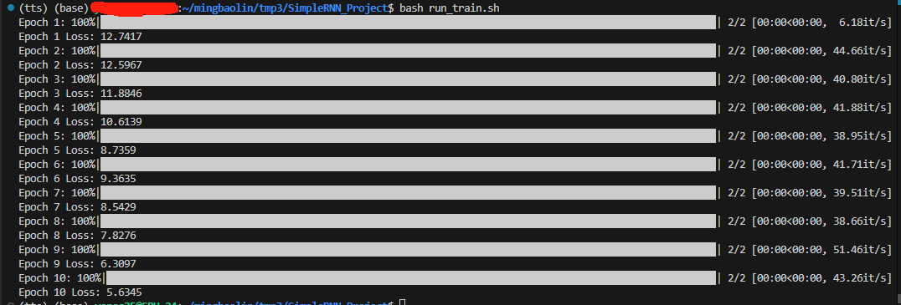
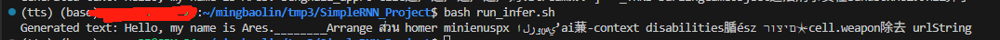

# 1. SimpleRNN Language Model

This projects implements a custom recurrent neural network (`SimpleRNN`) and a language modeling framework using PyTorch. It includes training and inference scripts, dataset loading, and basic token generation.


## Project Structure

```
simple_rnn_project/
|-- models/                # RNN and LM model definitions
|-- training/              # Training loop
|-- inference/             # Greedy decoding logic
|-- data/                  # Dataset and collate function
|-- run_train.py           # Training entry script (argparse-based)
|-- run_infer.py           # Inference entry script (argparse-based)
|-- train.sh               # Example shell script for training
|-- infer.sh               # Example shell script for inference 
```


## Quick Start

### 1. Install dependencies

```
pip3 install -r requirements.txt
```

### 2. Train the model

```bash
bash train.sh
```
You will see:




### 3. Run inference

```bash
bash infer.sh
```
You will see:




## References

- [PyTorch RNN Layers](https://pytorch.org/docs/stable/nn.html#recurrent-layers)  
- [HuggingFace Transformers](https://github.com/huggingface/transformers)


# 2. Self-Attention *vs*. SimpleRNN

Aspect | Self-Attention | SimpleRNN
|---|---------|-------|
|Parallelism | Full Parallel over time | Sequential over time (see [code](https://github.com/lmbxmu/SimpleRNN_Project/blob/d737a9380954a77861106be51dcce2ede7aad115/models/simple_rnn.py#L42))|
|Long-Range Dependancy | Captures well via global token-token interactions | Degrades with distance (vanishing influence) |
|Memory | Quadratic in sequence length | Linear in time |
|Interpretability | Attention weights are interpretable | Hard to trace intermediate steps|
|Computation Cost | High due to dot-product and softmax | Low due to local updates|
|Scalability | More scalable with GPUs | Challenging due to time dependency|


# 3. Scaling SimpleRNN training

I am not an expert on RNNs. Honestly speaking, below information is summarized from multiple sources I have searched from the Intenet.

## A. Sequence Truncation / Sliding Windows
- **Pros**: Reduces time dependency length, fits longer sequences into memory.
- **Cons**: Might lose long-term information.

## B. Layer-wise Parallelism
- **Pros**: Can run different layers in parallel (pipeline style).
- **Cons**: Latency bottleneck due to time steps still being sequential.

## C. Use of JIT and Fusion Kernels
- **Pros**: Speed-up via low-level CUDA or TorchScript optimizations.
- **Cons**: Complex to implement; limited to static graphs.

## D. Mixed Precision Training
- **Pros**: Faster training, less memory use.
- **Cons**: Might introduce numerical instability in recurrent loops.

## E. Truncated Backpropagation Through Time (TBPTT)
- **Pros**: Lower memory footprint.
- **Cons**: Incomplete gradients for long sequences.

## F. State Caching for Inference
- **Pros**: Avoid recomputation; essential in autoregressive generation.
- **Cons**: Might be stale if context changes significantly.